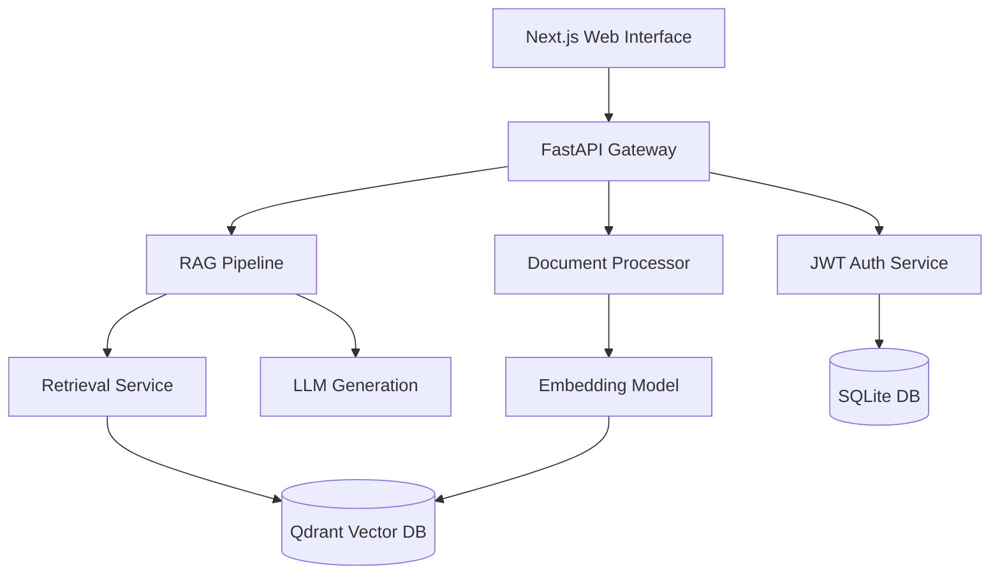

# KnowSphere AI 🧠

<div align="center">
  
  
  
  
</div>

<br />

**KnowSphere AI** is a state-of-the-art, general-purpose AI Knowledge Assistant. Built to process, index, and retrieve insights from complex unstructured documents, it empowers users to seamlessly chat with their data using an advanced **Retrieval-Augmented Generation (RAG)** pipeline.

Designed with scalability and performance in mind, KnowSphere AI serves use cases ranging from enterprise knowledge management and healthcare data retrieval to personal research organization.

---

## ✨ Key Features

- **Advanced Document Processing Pipeline**: Ingests, parses, cleans, and semantically chunks various document formats (PDF, DOCX, TXT, Markdown).
- **Intelligent RAG System**: Combines Hybrid Search (Semantic + Keyword) with Context Compression to feed highly relevant grounding to the LLM.
- **Local & Scalable Vector Storage**: Utilizes Qdrant (or local vector fallback) for lightning-fast high-dimensional vector similarity search via `BAAI/bge-small-en-v1.5` embeddings.
- **Modern Web Interface**: A sleek, responsive Next.js frontend featuring Dashboards, Chat Interfaces, Analytics, and Document Management.
- **Secure Authentication**: Robust JWT-based secure user authentication, role management, and session handling.
- **Analytics & Evaluation**: Built-in dashboards to track retrieval performance, hallucination rates, and LLM confidence metrics.

---

## 🛠️ Technology Stack

### Backend & AI
- **Framework**: FastAPI (Python)
- **Database**: SQLite / SQLAlchemy ORM + Alembic for migrations
- **Vector Database**: Qdrant / Local JSON storage
- **Embeddings**: HuggingFace (`BAAI/bge-small-en-v1.5`)
- **LLM Integration**: HuggingFace Inference API / Local LLM fallbacks

### Frontend
- **Framework**: Next.js (React)
- **Styling**: Tailwind CSS
- **State Management & Data Fetching**: Zustand / React Query

---

## 🏗️ Architecture Overview

The system is built on a clean, modular, and strict Dependency Injection architecture:



---

## 🚀 Installation & Setup

### Prerequisites
- Python 3.10+
- Node.js 18+ (for Next.js Frontend)
- Git

### 1. Backend Setup

```bash
# Clone the repository
git clone https://github.com/Aniket250105/KnowSphereAI.git
cd KnowSphereAI

# Create a virtual environment
python -m venv .venv
source .venv/bin/activate  # On Windows use: .venv\Scripts\activate

# Install dependencies
pip install -r requirements.txt

# Setup environment variables
cp .env.example .env
# Edit .env with your specific API keys and database paths

# Initialize the database
alembic upgrade head
```

### 2. Frontend Setup

```bash
cd frontend

# Install Node dependencies
npm install

# Setup frontend environment
cp .env.example .env.local

# Run the frontend development server
npm run dev
```

### 3. Running the Application

To start the backend server, run:
```bash
python run.py
```
*The FastAPI backend will run on `http://localhost:8000` and the frontend on `http://localhost:3000`.*

---

## 💻 Usage Guide

1. **Register/Login**: Create a user account to access your personal workspace.
2. **Upload Documents**: Navigate to the Documents dashboard and upload your files. The pipeline will automatically chunk and embed the contents.
3. **Chat**: Open the Chat interface and start asking questions. The AI will retrieve exact context from your documents and generate accurate, grounded answers.
4. **Evaluate**: Check the Analytics dashboard to view response confidence, query latency, and system health.

---

## 📁 Repository Structure

```text
KnowSphereAI/
├── src/                    # Core Python Backend
│   ├── api/                # FastAPI Routes
│   ├── auth/               # Authentication & Security
│   ├── database/           # SQLAlchemy Models & Repositories
│   ├── document_processing/# Parsers and Chunkers
│   ├── embeddings/         # Embedding Generation
│   ├── rag/                # RAG Pipeline & Context Ranking
│   └── vectorstore/        # Qdrant & Local Vector DB interfaces
├── frontend/               # Next.js Web Application
├── tests/                  # Unit and Integration Tests
├── docs/                   # Architecture & Phase Designs
├── data/                   # Local databases and raw files
├── alembic/                # Database Migrations
└── run.py                  # Backend Entry Point
```

---

## 📝 License

This project is licensed under the MIT License. See the `LICENSE` file for more details.
