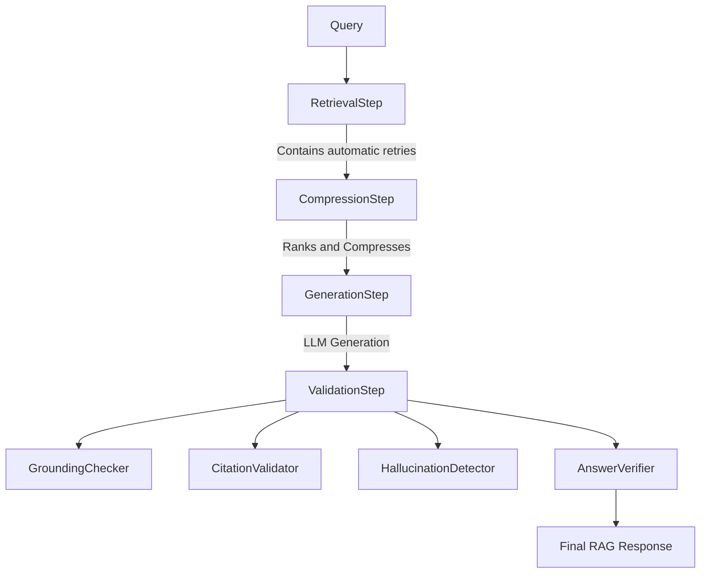

# Phase 8A: Advanced RAG Intelligence & Response Quality

## Overview
Phase 8A transitions KnowSphere AI from basic Retrieval-Augmented Generation to an Enterprise-grade Intelligence Pipeline. The goal is strictly enhancing answer quality, eliminating hallucinations, and guaranteeing grounded responses without modifying the foundational infrastructure.

## Core Architectural Additions

To preserve SOLID principles, we introduced an Orchestration Layer inside `src/rag/pipeline_steps/` supported by abstract interfaces in `src/rag/interfaces/`. 

The pipeline flow:

### 1. Retrieval Retry Strategy (`RetrievalStep`)
If the initial vector search yields low-confidence context, the system automatically expands the query using the `QueryExpander` (which normalizes, corrects spelling, expands abbreviations, and applies synonyms) and retries with a broader Top-K using Hybrid search.

### 2. Context Compression & Ranking (`CompressionStep`)
- **ContextRanker**: Adjusts raw similarities with penalties for redundant documents and late-stage chunk positions.
- **ContextCompressor**: Deduplicates retrieved segments and intelligently enforces maximum context boundaries, guaranteeing we never exceed LLM token limits while keeping the highest-priority chunks.

### 3. Generation & Prompts (`GenerationStep`)
Our prompt templates were strictly optimized:
- "Never invent facts."
- "If information is unavailable, respond exactly with: 'I couldn't find this information in the indexed documents.'"

### 4. Comprehensive Validation (`ValidationStep`)
- **GroundingChecker**: Emits a deterministic score (HIGH, MEDIUM, LOW) composed of 40% Context Coverage, 30% Citation Coverage, and 30% Semantic Similarity (approximated via Jaccard index).
- **CitationValidator**: Scans for inline citations (`[1]`, `[2]`) against the provided references and surfaces missing sources as warnings.
- **HallucinationDetector**: Evaluates the linguistic overlap between generated sentences and retrieved context, raising the `HallucinationRisk` metric if unsupported entities are claimed.
- **AnswerVerifier**: Acts as the ultimate quality gate, verifying the answer isn't paradoxically empty, too short, or claiming ignorance when the retrieval confidence was exceptionally high.

## Analytics Integration
The API response now aggregates comprehensive metadata:
- `compressed_chunks` & `original_chunks`
- `compression_ratio`
- `retry_count`
- `expanded_query`
- `evaluation` (Holding the results from the various validation agents)

These metrics allow continuous observability and future optimization.
